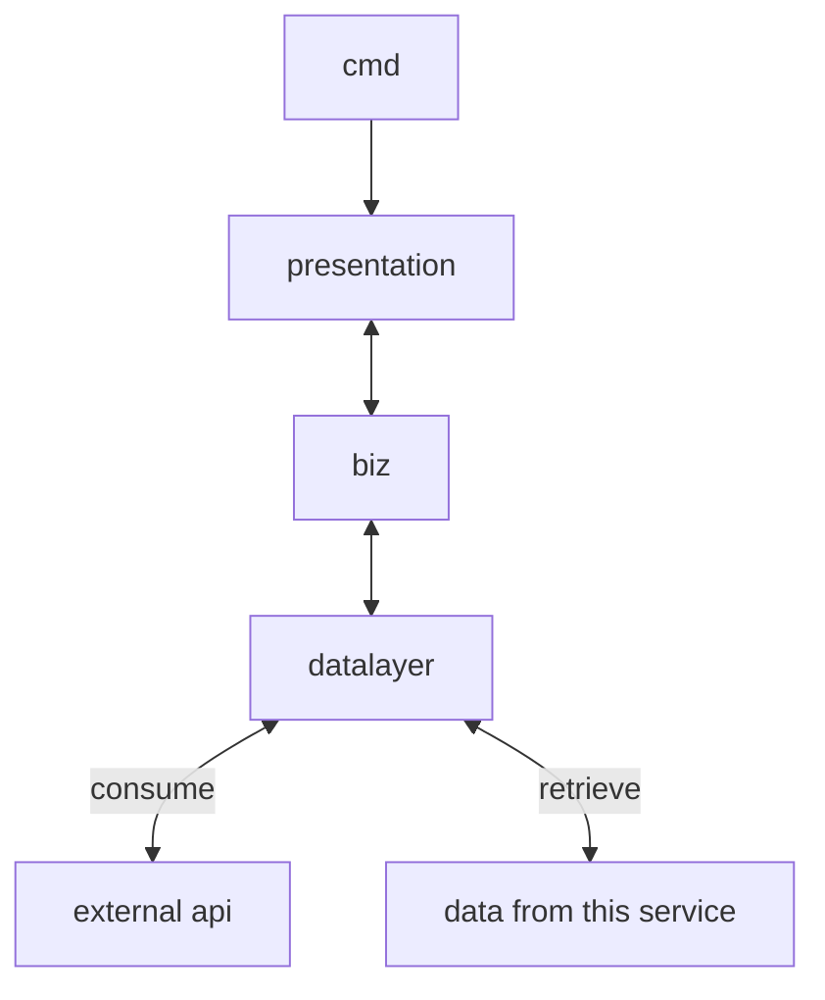
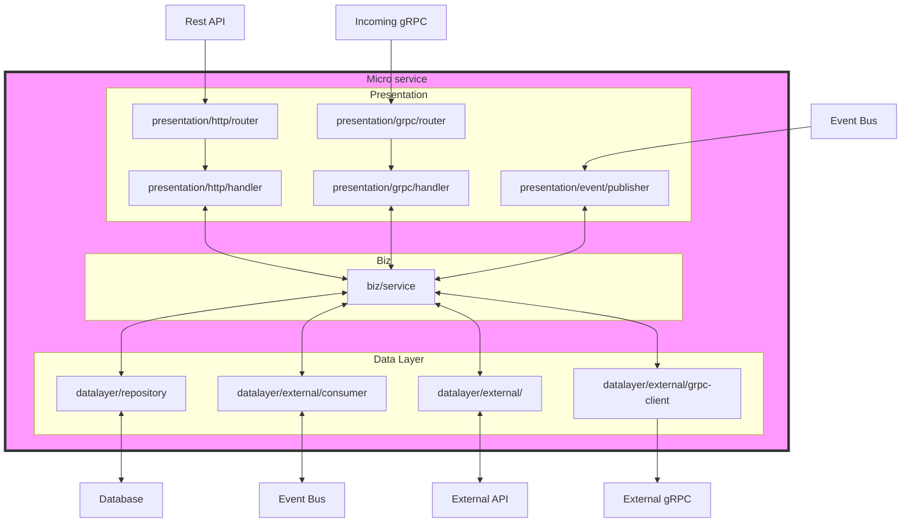

# boilerplate-backend

## Dicretory Structure

```
project-root/
.
├── Makefile                        
├── README.md
├── biz
├── cmd                                            # Application entry points
│   ├── adapters
│   │   ├── database.go
│   │   ├── logger.go
│   │   └── server.go
│   └── main.go
│
├── datalayers                                     #  Data Access & External Data Integration Layer
│   ├── cache
│   │   └── example.go
│   └── datasources
│       ├── external
│       │   └── consumers
│       │       └── company_consumer_example.go
│       └── repositories
│           ├── generic_repo.go
│           ├── user_repo.go
│           └── ...
│
├── docker-compose.yml
├── go.mod
├── go.sum
├── models
│   ├── User.go
│   ├── base.go
│   └── error.go
│   └──...
│
├── pkg                                            # Shared Utility & Common Packages like config, kafka, logger...
│   ├── database
│   │   ├── cockroachDB
│   │   │   ├── cockroachDB.go
│   │   │   ├── migration.go
│   │   │   ├── migrations
│   │   │   │   └── 00001_create_user_table.sql
│   │   │   └── options.go
│   │   └── mongoDB
│   │   └──...
│   │   
│   ├── kafka
│   │   ├── event.go
│   │   ├── kafka.go
│   │   └── options.go
│   │
│   ├── logger
│   │   ├── internal
│   │   │   └── zaplogger.go
│   │   └── logger.go
│   │
│   ├── redis
│   │   └── redis.go
│   └── ...
│   │
│   └── utils
│       ├── config
│       │   └── config.go
│       ├── error.go
│       ├── http.go
│       ├── retry.go
│       └── structToMap.go
│       └── ...
│
└── presentation                                     # API & External Communication Layer
    ├── enter.go
    └── http
        └── server.go
```
### Explaination

1. **`cmd/` - Application Entry Point**

This folder contains the main entry points of the application. It is responsible for:
* Bootstrapping and initializing the application.

* Managing dependencies and lifecycle using GoLobby.

* Wiring up services and their dependencies before execution.

* Defining different executables (e.g., main.go for the main service, worker scripts, scheduled jobs, and CLI tools).

* Handling application startup configuration, including environment variables and command-line arguments.

* Ensuring graceful shutdown and cleanup mechanisms for all running services.

2. **`presentation/` -  API & External Communication Layer**

This directory is responsible for exposing application functionalities to external systems. It acts as a gateway for external service or frontend applications to interact with the system, including:
* HTTP API endpoints (e.g., RESTful APIs using Gin or Echo).

* gRPC service definitions and implementations for high-performance RPC.

* GraphQL endpoints for flexible data querying.

* Message queue publishers for asynchronous processing (e.g., Kafka, RabbitMQ, or NATS streaming).

* WebSocket endpoints for real-time communication.

* Middleware integrations for authentication, authorization, logging, and request tracing.

* Routing and request validation, ensuring structured API contracts.

This layer interacts with the business logic layer (biz/), receiving requests and passing them through for processing before returning structured responses.

3. **`biz/` -  Business Logic Layer (Core Service Layer)**

This directory contains all the core business logic and domain operations. It serves as the heart of the application, responsible for:
* Implementing the core business rules of the application.

* Processing incoming data and enforcing validation rules.

* Orchestrating logic across different sub-modules.

* Calling the data layer (datalayers/) to retrieve or persist data.

* Abstracting complex logic into service modules that can be reused across different interfaces.

* Implementing domain-driven design (DDD) concepts, ensuring separation of concerns.

* Supporting transactional operations, ensuring consistency in complex workflows.


4. **`datalayers/` - Data Access & External Data Integration Layer**

This layer is responsible for all interactions with data sources and external dependencies, including:

* Database interactions (e.g., SQL databases via Gorm, NoSQL stores like MongoDB, Redis for caching, or graph databases like Neo4j).

* Consuming messages from external services via message queues (e.g., Kafka consumers, RabbitMQ subscribers, or AWS SQS workers).

* Making outbound API calls to external services (e.g., gRPC clients, RESTful API consumers, third-party authentication providers, payment gateways, etc.).

* ORM and raw query handlers to optimize data retrieval and reduce latency.

* Cache management to improve application performance by reducing database load.

* Batch processing and scheduled jobs to fetch or synchronize data periodically from external sources.

The `datalayers/` abstracts data retrieval and storage, ensuring that `biz/` logic remains independent of specific storage implementations. This separation allows for easier testing and swapping of data providers without affecting business logic.

5. **`pkg/` - Shared Utility & Common Packages**

The `pkg/` directory contains reusable modules and libraries used throughout the service, such as:

* Logging utilities (e.g., Zap, Logrus, structured logging frameworks).

* Configuration management (e.g., reading from .env files, Kubernetes ConfigMaps, or Consul service discovery).

* Middleware utilities (e.g., authentication, rate-limiting, error handling, and tracing integrations for OpenTelemetry, Jaeger, or Datadog).

* Helper functions and common utilities (e.g., date/time utilities, string formatting, encryption, and token generation).

* Metrics and monitoring tools (e.g., Prometheus exporters, Grafana dashboards, or CloudWatch integrations).

This directory ensures modularity by providing reusable functionalities across different modules of the project.
## Data flow and Architecture Overview

The application follows a well-structured data flow to ensure scalability, maintainability, and high performance. The modular design ensures that each layer has a single responsibility and interacts in a well-defined manner.



### 1. Request flow (HTTP/gRPC Call Example):
1. `cmd/` initializes the app, sets up dependencies, and starts this service.

2. `presentation/` receives the request, validates input, and routes it to the appropriate business logic.

3. `biz/` processes the request, applying business rules and logic.

4. `datalayers/` retrieves required data, calling databases, caches, or external services.

5. The processed result is returned back up the chain to presentation/, which sends the response.

### 2. Event-Driven Processing Flow (Message Queue Example)

1. `datalayers/` consumes messages from an external system via Kafka, RabbitMQ, or AWS SQS.

2. `biz/` processes the data, applying necessary transformations or business rules.

3. `presentation/` may publish new messages to a queue or update external systems asynchronously.

4. `State is persisted in the database`, and an event notification can be sent to notify other microservices.


